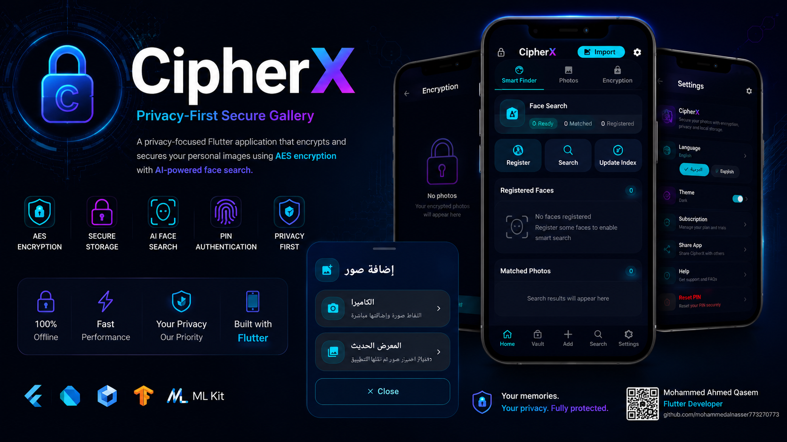
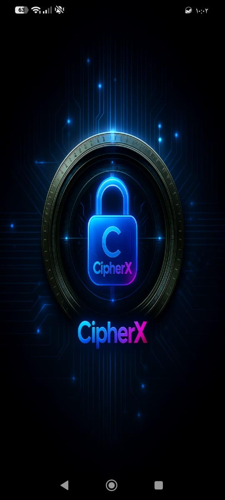
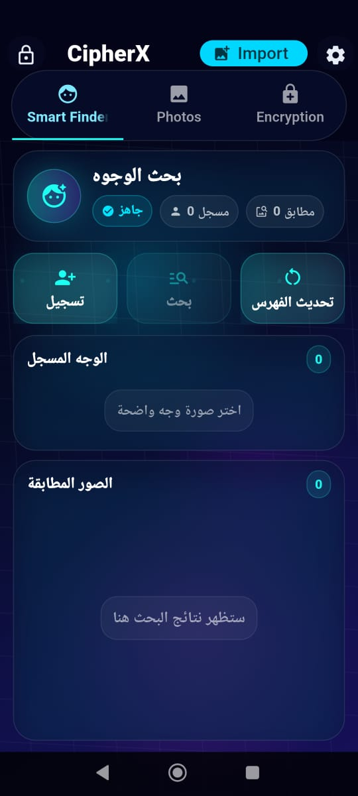
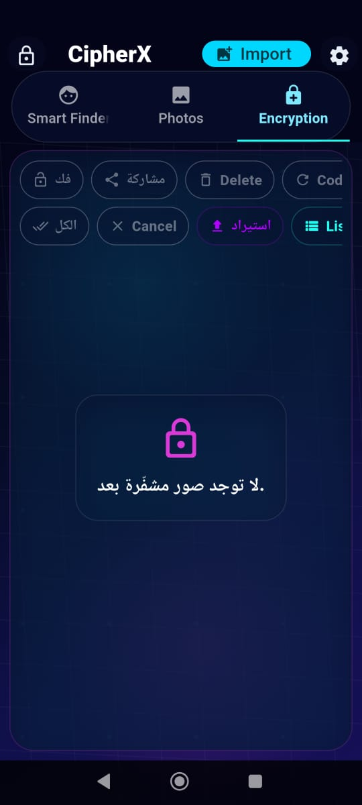
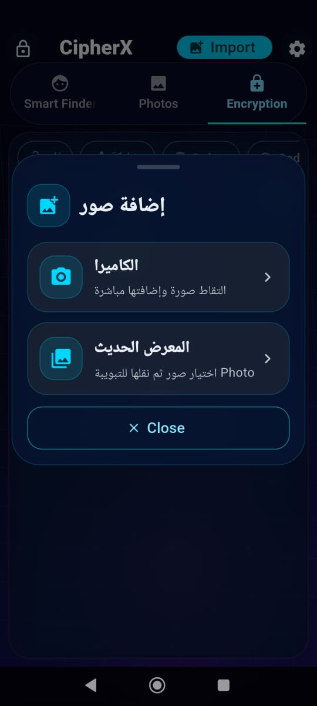
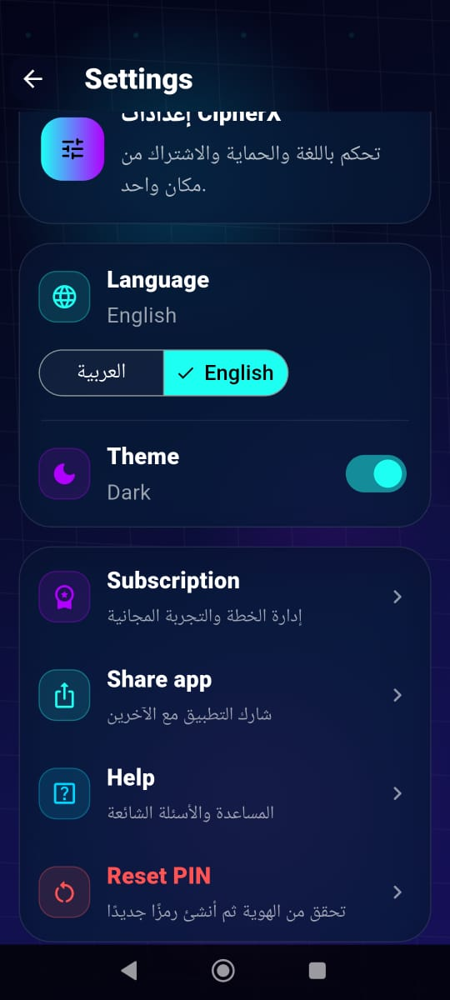

<p align="center">

</p>

<h1 align="center">🔐 CipherX</h1>

<p align="center">

Privacy-First Flutter Application

Secure • Offline • AI Powered • AES Encrypted

</p>

<p align="center">


</p>

---

# 📖 Overview

CipherX is a modern privacy-focused Flutter application that protects personal photos using military-grade AES encryption and secure local storage.

Unlike traditional gallery applications, CipherX performs all image protection and AI processing locally on the user's device without uploading any data to external servers.

The application combines cybersecurity principles with modern Flutter development to provide a secure, fast, and user-friendly experience.

---

# ✨ Features

- 🔐 AES Image Encryption
- 📂 Secure Local Vault
- 👤 AI Face Recognition
- 🔎 Smart Face Search
- 🔑 PIN Authentication
- 🌙 Dark Cyber UI
- 🌍 Arabic & English Support
- ⚡ Fast Local Processing
- 📱 Material Design 3
- 🔒 Privacy-First Architecture
- 💾 Offline Storage
- 📸 Camera & Gallery Import

---

# 📱 Screenshots

## Splash Screen

<p align="center">

</p>

---

## Smart Finder

<p align="center">

</p>

---

## Encryption

<p align="center">

</p>

---

## Import Images

<p align="center">

</p>

---

## Settings

<p align="center">

</p>

---

# 🏗 Architecture

The project follows a clean and scalable architecture.

```
lib
│
├── core
│
├── features
│   ├── encryption
│   ├── smart_finder
│   ├── photos
│   └── settings
│
├── services
│
├── shared
│
└── main.dart
```

---

# 🛠 Tech Stack

### Framework

- Flutter

### Language

- Dart

### State Management

- BLoC / Cubit

### AI

- Google ML Kit
- TensorFlow Lite

### Security

- AES Encryption
- Secure Local Storage

### Design

- Material Design 3

---

# 🔐 Security Highlights

CipherX was designed with security and privacy as the highest priorities.

Main security features include:

- AES Encryption
- Local Image Storage
- Offline Face Recognition
- PIN Authentication
- No Cloud Upload
- No External Image Processing
- Secure Local Database

---

# 🚀 Performance

- Fully Offline
- Fast Image Encryption
- Local AI Processing
- Lightweight Architecture
- Responsive UI

---

# 📂 Project Structure

```
lib/
│
├── core/
├── features/
├── models/
├── repositories/
├── services/
├── widgets/
├── localization/
├── shared/
└── main.dart
```

---

# 🚀 Getting Started

Clone the repository

```bash
git clone https://github.com/mohammedalnasser773270773/CipherX.git
```

Open project

```bash
cd CipherX
```

Install packages

```bash
flutter pub get
```

Run the application

```bash
flutter run
```

---

# 📌 Requirements

- Flutter 3.x
- Dart 3.x
- Android Studio / VS Code
- Android SDK

---

# 🎯 Project Goals

- Protect personal images
- Learn advanced Flutter architecture
- Apply cybersecurity concepts
- Integrate AI into mobile applications
- Build a production-quality portfolio project

---

# 📈 Future Improvements

- Fingerprint Authentication
- Face Unlock
- Secure Cloud Backup
- Video Encryption
- Folder Encryption
- Secure File Sharing
- Multi-Device Synchronization
- Advanced Search Filters

---

# ⚠ Portfolio Notice

This repository is published for portfolio and demonstration purposes.

The application showcases Flutter development skills, cybersecurity concepts, local encryption, and AI-powered face recognition.

Unauthorized copying, redistribution, modification, or commercial use of the source code is prohibited without prior written permission from the author.

---

# 👨‍💻 Author

## Mohammed Ahmed Qasem

**Cyber Security Graduate**

**Flutter Developer**

📧 mohammedalnasser573@gmail.com

💼 LinkedIn

https://linkedin.com/in/mohammed-ahmed-b0bb82320

🐙 GitHub

https://github.com/mohammedalnasser773270773

---

# ⭐ Support

If you like this project, consider giving it a ⭐ on GitHub.
